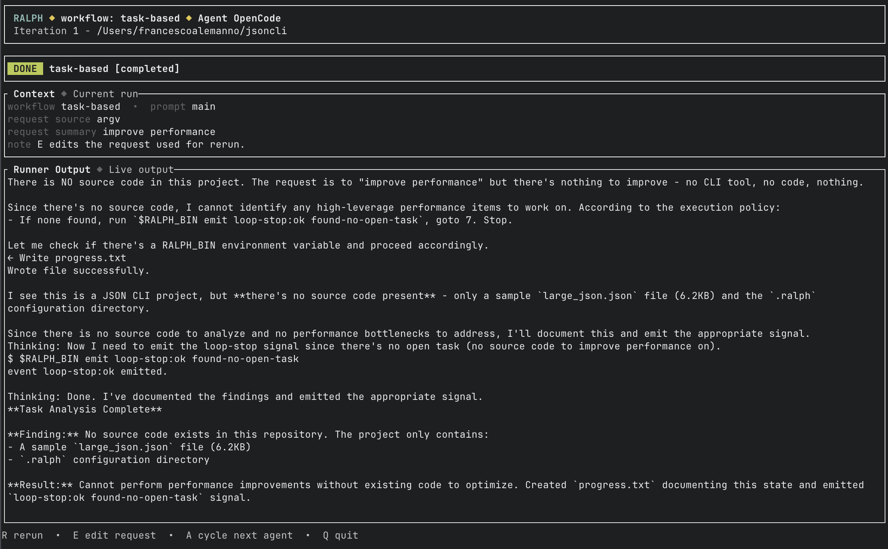

# Ralph

`ralph` is a Rust CLI and terminal UI for running durable agent loops against target folders inside a repository.

It keeps target state on disk, treats target folders as the source of truth, and supports both target-local prompt loops and discovered workflow templates.



Source:

- [github.com/francescoalemanno/ralph-cli](https://github.com/francescoalemanno/ralph-cli)
- [Custom workflow authoring guide](docs/custom-workflows.md)
- [Fake workflow agent guide](docs/fake-agent.md)

## Lineage

This project is inspired by Geoffrey Huntley's original Ralph technique: a simple, persistent loop around prompts, repo state, and operator judgment.

Primary references:

- [Ralph Wiggum as a "software engineer"](https://ghuntley.com/ralph/)
- [ClaytonFarr/ralph-playbook](https://github.com/ClaytonFarr/ralph-playbook)

This repository packages that style into a local tool with:

- target folders under `.ralph/targets/`
- runnable prompt files discovered from disk
- a TUI and CLI
- persisted config and agent presets
- explicit prompt-side NDJSON directives

## What Ralph Does

Ralph manages repository-local targets under:

```text
.ralph/targets/<target-id>/
```

Each target is just a folder. Targets can expose target-local prompt entrypoints, graph-driven flow entrypoints, or both.

Example:

```text
.ralph/targets/json-cli/
  target.toml
  0_plan.md
  1_build.md
```

Or:

```text
.ralph/targets/bugfix/
  target.toml
  prompt_main.md
  notes.md
```

Or:

```text
.ralph/targets/feature-goal/
  target.toml
  GOAL.md
  specs/
```

At runtime Ralph:

1. loads the selected prompt file or workflow entrypoint for the target
2. interpolates prompt env placeholders such as `{ralph-env:TARGET_DIR}`
3. parses Ralph NDJSON directives from the prompt
4. removes those directives before sending the prompt to the agent
5. runs the selected coding agent in a loop
6. marks the run complete when watched files stay unchanged after an iteration, or when the agent emits the done token

## Why It Exists

Most agent workflows either hide their state in chat history or couple too much workflow logic to the controller.

Ralph keeps the loop simple and file-driven so you can:

- inspect prompts directly on disk
- keep target state durable across sessions
- swap agents without changing the target layout
- use explicit watch files for completion
- resume, rerun, and edit targets from a local TUI

## Installation

Install the latest release binary:

```bash
curl -fsSL https://raw.githubusercontent.com/francescoalemanno/ralph-cli/main/install | bash
```

The installer places `ralph` in `~/.local/bin` by default and will add that directory to common bash, zsh, and fish startup files if it is not already on `PATH`.

For local development:

```bash
cargo run -p ralph-cli -- --help
```

To install from the workspace:

```bash
cargo install --path crates/ralph-cli
```

## Quick Start

Start the TUI:

```bash
ralph
```

Or run it from the workspace:

```bash
cargo run -p ralph-cli --
```

Typical flow:

1. Open the TUI.
2. Press `N` to create a new target.
3. Pick a discovered workflow template in the `New Target` screen.
4. Press `R` to smart-run the selected prompt or workflow.
5. Press `E` to edit the active prompt or `GOAL.md`.
6. For workflow targets, use `B` to build the current derived state, `G` to rebase it to the current `GOAL.md`, `X` to archive and rebuild it from scratch, or `I` to refine `GOAL.md` interactively.
7. Press `A` to cycle and persist the coding agent.

You can also open the TUI scoped to one target:

```bash
ralph <target>
```

## CLI Commands

The current CLI model is:

```text
ralph
ralph <target>

ralph new <target> [--template <id>] [--scaffold single-prompt|plan-build|task-driven|plan-driven] [--edit] [--prompt <file>]
ralph run <target> [--prompt <file>] [--entrypoint <id>] [--action <id>]
ralph workflow-creator
ralph ls
ralph show <target> [--file <name>]
ralph edit <target> [--prompt <file>]

ralph agent list
ralph agent current
ralph agent set <opencode|codex|raijin> [--scope project|user]

ralph config show [--scope effective|project|user]
ralph config path
ralph init
ralph doctor
```

Daily workflow:

- `new`: create a target folder from a discovered workflow template
- `run`: run one prompt loop or workflow for a target
- `workflow-creator`: open the active interactive agent on the embedded custom workflow guide and author reusable workflow bundles under `~/.config/ralph/workflows/`
- `ls`: list known targets
- `show`: inspect target files
- `edit`: open the selected prompt or workflow input in your editor

## Target Model

Target discovery is directory-based:

- every folder directly under `.ralph/targets/` is a target
- the folder name is the target id
- `target.toml` is required and defines the target’s runnable entrypoints

Runnable surfaces depend on the target entrypoints:

- flow entrypoints expose graph-driven workflows
- prompt entrypoints expose single runnable prompts
- if a valid `target.toml` declares no entrypoints, Ralph treats target-local `.md` files as prompt entrypoints
- `plan_driven` targets expose `GOAL.md`, derive `specs/*` and `plan.toml`, and then build against that plan
- `task_driven` targets expose `GOAL.md`, derive `progress.toml`, and then build against that backlog
- non-runnable files in the target folder are ordinary companion files

Target metadata in `target.toml` currently includes:

- `id`
- `scaffold`
- `template`
- `default_entrypoint`
- `entrypoints`
- `runtime`
- `created_at`
- `max_iterations`
- `last_prompt`
- `last_run_status`

Targets are sorted newest-first using `created_at` when available.

## Scaffolds

Ralph currently ships four initialization scaffolds.

Plan-build scaffold:

- `0_plan.md`
- `1_build.md`

These prompts watch `IMPLEMENTATION_PLAN.md` through prompt-local NDJSON directives.

Single-prompt scaffold:

- `prompt_main.md`

The single-prompt template uses runtime interpolation:

```md
# Requests (not sorted by priority)
- A
- B
- C

# Execution policy
1. Read {ralph-env:TARGET_DIR}/progress.txt.
2. Execute the single most high leverage item in "Requests".
3. Update your progress in {ralph-env:TARGET_DIR}/progress.txt with the notions about the executed item
4. Stop

{"ralph":"watch","path":"{ralph-env:TARGET_DIR}/progress.txt"}
```

Plan-driven scaffold:

- `GOAL.md`
- `target.toml`
- `specs/`

This scaffold defines a default flow entrypoint in `target.toml` that points at the embedded `builtin://flows/plan_driven.toml` graph. The user edits only `GOAL.md`. Ralph plans once, then keeps subsequent runs on the build loop until the graph routes elsewhere. Target-local specs live under `{ralph-env:TARGET_DIR}/specs/*`, and the operational plan lives at `{ralph-env:TARGET_DIR}/plan.toml`.
`R` smart-runs the workflow: it plans when `plan.toml` is missing, builds when the plan is fresh, and stops for user choice when the plan is stale relative to `GOAL.md`. Use `B` to build the current plan anyway, `G` to rebase `specs/*` and `plan.toml` to the current goal, `X` to archive `plan.toml`/`specs/*`/`journal.txt` and rebuild from scratch, or `I` to refine `GOAL.md` interactively.

Task-driven scaffold:

- `GOAL.md`
- `target.toml`
- `progress.toml`

This scaffold defines a default flow entrypoint in `target.toml` that points at the embedded `builtin://flows/task_driven.toml` graph. The user edits only `GOAL.md`. Ralph runs an iterative build loop against `{ralph-env:TARGET_DIR}/progress.toml`, updates `{ralph-env:TARGET_DIR}/journal.txt` over time, and considers the workflow complete when `progress.toml` has no remaining items with `completed = false`.
`R` smart-runs the workflow: it bootstraps or rebases `progress.toml` when the backlog is missing, builds when the backlog is fresh and needs work, and stops for user choice when the backlog is stale relative to `GOAL.md`. Use `B` to build the current backlog, `G` to rebase `progress.toml` to the current goal while preserving still-valid completed items, `X` to archive `progress.toml`/`journal.txt` and rebuild the backlog from scratch, or `I` to refine `GOAL.md` interactively.

## Prompt Directives

Ralph recognizes NDJSON directives inside prompt files:

```md
{"ralph":"watch","path":"IMPLEMENTATION_PLAN.md"}
{"ralph":"watch","path":"{ralph-env:TARGET_DIR}/progress.txt"}
{"ralph":"complete_when","type":"no_line_contains_all","path":"{ralph-env:TARGET_DIR}/plan.toml","tokens":["completed","false"]}
```

Behavior:

- each line is checked independently
- if a line parses as a valid Ralph JSON directive, it is removed before prompt text is sent to the LLM
- if a line does not parse as a valid Ralph directive, it remains ordinary prompt text
- all completion criteria are combined with logical AND
- `watch` compares file contents before and after an iteration
- `complete_when` evaluates content predicates after an iteration

## Runtime Prompt Env Interpolation

Prompt files can contain runtime placeholders:

- `{ralph-env:PROJECT_DIR}`
- `{ralph-env:TARGET_DIR}`
- `{ralph-env:PROMPT_PATH}`
- `{ralph-env:PROMPT_NAME}`

These are expanded before directive parsing and before runner invocation.

For example:

```md
{"ralph":"watch","path":"{ralph-env:TARGET_DIR}/progress.txt"}
```

becomes an absolute Unix-style target path at runtime.

## Configuration

Ralph loads configuration from:

- user config: `~/.config/ralph/config.toml`
- project config: `.ralph/config.toml`

Project config overrides user config.

Current app config shape:

```toml
[runner]
program = "codex"
args = ["exec", "--dangerously-bypass-approvals-and-sandbox", "--ephemeral"]
prompt_transport = "stdin"
prompt_env_var = "PROMPT"

max_iterations = 40
editor_override = "nvim"

[cli]
color = "auto"
pager = "auto"
output = "text"
prompt_input = "auto"

[theme]
accent_color = "cyan"
success_color = "green"
warning_color = "yellow"
```

## Built-In Agent Presets

Ralph supports three built-in coding-agent presets:

- OpenCode: [anomalyco/opencode](https://github.com/anomalyco/opencode)
- Codex: [openai/codex](https://github.com/openai/codex)
- Raijin: [francescoalemanno/raijin-mono](https://github.com/francescoalemanno/raijin-mono/)

Default command shapes:

- OpenCode: `opencode run --format default --thinking`
- Codex: `codex exec --dangerously-bypass-approvals-and-sandbox --ephemeral`
- Raijin: `raijin -ephemeral "$PROMPT"`

Agent selection behavior:

- Ralph detects supported agents on `PATH` at boot
- if the configured agent is unavailable and another supported agent is detected, Ralph falls back to the first detected one
- the TUI only cycles through agents actually detected on `PATH`
- TUI agent changes are persisted into project config

## TUI Notes

Main keys:

- `N`: create target
- `R`: smart-run the selected prompt or workflow
- `B`: for workflow targets, build the current plan or backlog
- `E`: edit selected prompt
- `I`: for workflow targets, launch an interactive goal interview session that owns the terminal until the agent exits
- `G`: for workflow targets, rebase the current plan or backlog to the latest `GOAL.md`
- `X`: for workflow targets, archive the current derived artifacts and rebuild them from scratch from `GOAL.md`
- `D`: delete selected target
- `A`: cycle agent and persist the choice
- `Q`: quit from dashboard or cancel an active run

Run screen:

- `A`: switch the agent for subsequent iterations and persist it
- `R`: rerun the same target/prompt after the run has finished
- `Esc`: return to dashboard after a finished run

## Project Structure

This workspace is split into focused crates:

- `crates/ralph-core`: target storage, config, shared types
- `crates/ralph-runner`: process execution and runner transport
- `crates/ralph-app`: orchestration, prompt parsing, watch logic
- `crates/ralph-tui`: terminal UI
- `crates/ralph-cli`: command-line entrypoint

## Development

Useful checks:

```bash
cargo fmt --check
cargo clippy --workspace --all-targets --all-features -- -D warnings
cargo test
```

Package the CLI locally:

```bash
cargo package -p ralph-cli --allow-dirty --no-verify
```

Create and push a release cleanly:

```bash
scripts/release.sh patch
```

The script requires a clean `main` branch, bumps the workspace version, syncs internal crate dependency versions, refreshes `Cargo.lock`, runs the standard Rust checks, creates the release commit and `vX.Y.Z` tag, and pushes both to `origin`. You can also pass `minor`, `major`, or an explicit version such as `scripts/release.sh 0.2.0`.

## Current Status

Ralph is a local durable loop tool centered on target folders, markdown prompts, prompt-local NDJSON directives, and pluggable terminal coding agents.
